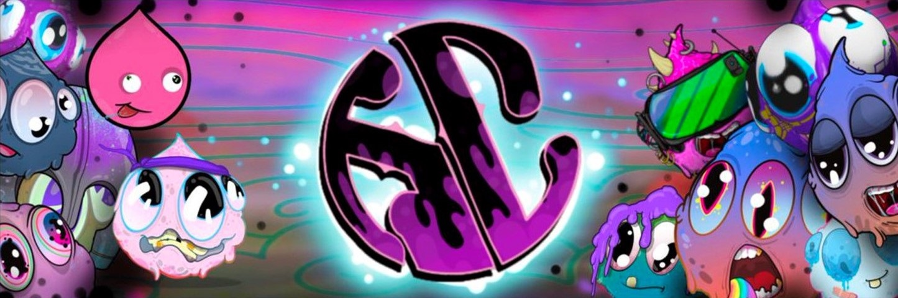

# 🍞 About The Jelly Collective

<figure><figcaption></figcaption></figure>

## <mark style="color:purple;">What is Jelly?</mark>

We take pride in our collaborations with nonprofit charity projects dedicated to animal welfare, a holistic approach not only empowers our community but also enables us to make a meaningful impact on causes that resonate deeply with us.\
\
At the heart of the Jelly Collective, it is our commitment to create a unique and unparalleled experience within the WEB3 Universe. \
\
This mission transcends the mere cultivation of a robust community, encompassing the realms of art, character creation, storytelling, and the pioneering integration of groundbreaking innovations in blockchain technology, gaming, and Metaverse expansion. \

## <mark style="color:purple;">Utility</mark>&#x20;

**The Collective Token : Jelly Dough ($JDOH)**

* **Token Type:** ERC20 Token
* **Blockchain:** Polygon

Jelly Dough ($JDOH) serves as the core utility token for the collective.&#x20;


[community-token.md](guides/community-token.md)

