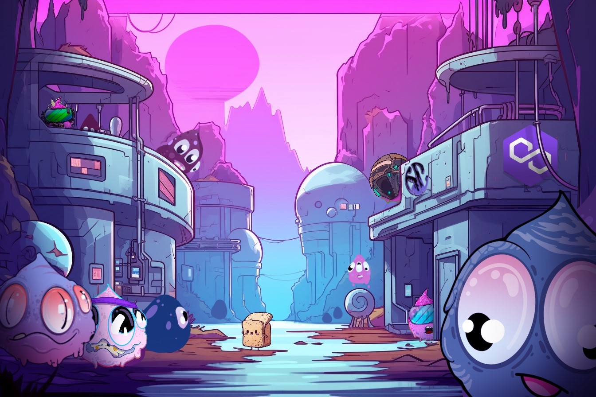

# 🍞 Collections and Utilities

The Jelly Collectives' art direction showcases hundreds of distinct and original traits, resulting in a diverse array of characteristics and personalities within each Collection.\
\
&#x20;While every Collection collaborates to build the Jelly Eco-System, each one possesses its unique utility, empowering its holder to engage in various aspects of the adventure individually or simultaneously.

The Jelly Genesis Collection

A generative PFP Collection boasting original and unique traits that would set the esthetic of future Jelly collections and collectibles.\
\
_Utility:_\
Perpetual WL Capabilities - Genesis Holders will enjoy eternal access to whitelist discounts and exclusive minting privileges., as well but not limited to Exclusive Discord Roles, Allowances and other special perks for holding.

The Jelly Alpha Collection

The Alphas led the project from its inception, establishing strategic partnerships and collaborations across a broad spectrum of WEB3 NFT projects and beyond. Boasting an extensive array of over 200 unique traits, the initial total supply was set at 4.2k. As the project continued to develop and navigate the ever-changing market dynamics, the Alphas themselves underwent transformation.

However, an unforeseen twist unfolded when a significant fire ravaged Alpha Labs, engulfing half of the supply in unyielding flames and reducing it to ashes. This tragic event led to the placement of the surviving Jellies for adoption, marking a poignant chapter in our project's journey.

***

**The Evolution**

The Alpha Jellies are on the cusp of their transformative journey into their next evolutionary phase.

Holders of the Alpha Collection will receive an exclusive EV0-Token, facilitating the evolution of their Jelly into the forthcoming collection. This transition introduces a fresh layer of utility and a novel mechanism for earning.

***

**Staking**\
The upcoming Evo Jelly Collection will introduce a Non-Custodial Staking Contract, allowing Jelly NFT owners to maintain full ownership of their assets while earning [tokens](community-token.md).

Owners will be required to register their acquired Evo-Jellies, triggering a user-friendly display showcasing the cumulative earnings from their held NFTs.\
\
**Accelerated Earning**\
The Evo Reward System will feature an enhanced mechanism that empowers various collections and tokens to contribute to multiplied earnings, a system determined by the community. This opens doors for partners and collaborators to amplify the rewards for staked tokens, fostering a collaborative and community-driven approach to value generation.

The Jelly Collectibles 

The Jelly Lab Creations

JellyGoonZ

<figure><figcaption></figcaption></figure>

##
