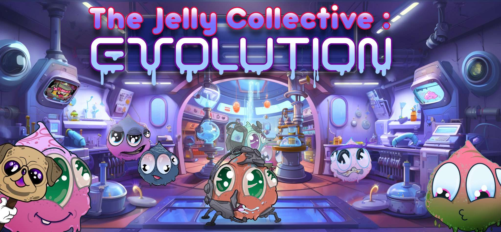

# 🧬 A Guide To Evolve

<figure><figcaption></figcaption></figure>

## <mark style="color:purple;">A New Era of Bread 🍞</mark>&#x20;

Introducing a new era in the world of NFTs with the revolutionary Evo Collection!

One of the groundbreaking features of the Evo Collection is the **non-custodial staking**. This unique feature ensures that while you earn staking rewards, the ownership and control of your NFTs remain unassailable in your hands. It's a seamless blend of earning and owning, designed specifically for the modern NFT enthusiast.

Diving deeper into the roots of the Evo Collection, it's a harmonious amalgamation of two distinct yet equally mesmerizing collections: The [**Alpha Jelly Collection**](../guides/collections-and-utilities.md#the-jelly-alpha-collection) and [**Jelly3DropZ**](../guides/collections-and-utilities.md#jelly3dropz).

🌟 Proudly presenting the newly merged collection that symbolizes unity and progression:

* ## <mark style="color:purple;">The EV0-Jelly Collection</mark>&#x20;

Drawing its essence from the mesmerizing artwork and distinctive traits of the Alpha Jelly, the Evo Collection showcases:&#x20;

✨ A plethora of significant enhancements ensuring a richer experience.&#x20;

🖌️ Intriguing additions that breathe fresh life into the collection.&#x20;

🌈 A balanced color palette that soothes the eye and captures the heart.&#x20;

🎨 Refined aesthetics, fine-tuned to perfection, guaranteeing a visually stunning experience.

Embark on this exhilarating journey with us, as we usher in an age where art meets innovation in the most enchanting way possible.&#x20;

## How to Evolve:

<mark style="color:purple;">**Eligibility for Evolution**</mark><mark style="color:purple;">:</mark>

* Possess either an Alpha Jelly or Jelly3Drop NFT before the official snapshot date.

<mark style="color:purple;">**Snapshot Announcement**</mark><mark style="color:purple;">:</mark>

* Official notifications regarding the snapshot will be disseminated through our Discord channel and Twitter handle.

<mark style="color:purple;">**Snapshot Process**</mark><mark style="color:purple;">:</mark>

* The system will autonomously record all holder addresses and their corresponding NFT counts.
* Based on this record, EV0-Tokens will be dispatched to holder wallets in alignment with their designated quantities.

<mark style="color:purple;">**About EV0-Tokens**</mark><mark style="color:purple;">:</mark>

* EV0-Tokens are a unique ERC20 token crafted exclusively for this event.
* While they will not have provided liquidity, they preserve the capability to mint the Evo-Jelly Collection.
* Conversion Rate:
  * 1 EV0-Token will mint 1 Evo-Jelly.
  * Holders of Alpha Jelly NFTs will receive an airdrop of 1 EV0-Token for every Alpha Jelly NFT in possession. (1:1 ratio)
  * For every 3 Jelly3DropZ NFTs held, 1 EV0-Token will be airdropped. (3:1 ratio)

<mark style="color:purple;">**Genesis Jelly Collection Utility**</mark><mark style="color:purple;">:</mark>

* The Genesis Jelly Collection will empower its snapshot holders with Whitelist (WL) privileges.
* For each Genesis Jelly retained, there will be an available Whitelist mint.
